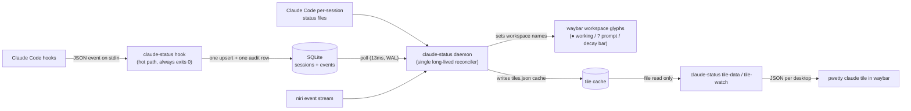
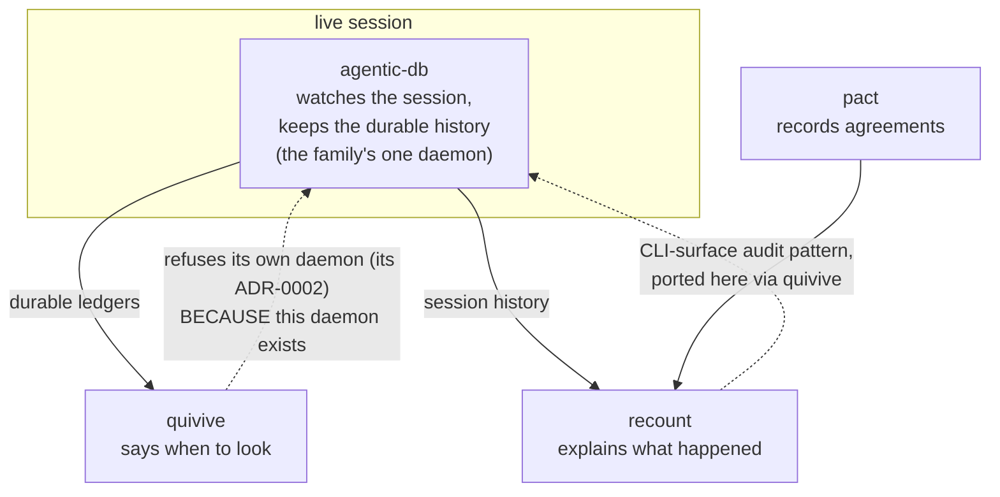

# Architecture

## Data flow

One writer per boundary: hooks write only the DB; the daemon is the only
writer of compositor state (workspace names) and of the tile cache; the tile
subcommands only read. The split itself is
[ADR-0001](adr/0001-hook-daemon-split.md); the store is
[ADR-0002](adr/0002-sqlite-as-the-store.md).



The tile payload contract is `tiles/claude/schema.json` in the
**waybar-pwetty-box** repository.

## The family

agentic-db is one seat in a small family of tools around agentic coding
sessions. The seats, in one line each: **pact** records the agreements,
**recount** explains what happened, **quivive** says when to look, and
**agentic-db** watches the live session and keeps the durable history.



Diagrams are Mermaid in-markdown; images-as-diagrams are banned. Screenshots
of the rendered glyphs/tile are *evidence*, not diagrams, and live in
`docs/media/`.

## Package layout

```
main.go              multi-call dispatch (switch os.Args[1])
internal/state       shared name grammar, decay table, event->state mapping, render tables
internal/db          SQLite layer (schema, Session, Open/Upsert/LoadLive/...)
internal/niri        niri IPC: ListWindows + event-stream client + window/workspace model
internal/hook        hook subcommand (state derivation, /proc->window resolution, audit row)
internal/clauded     reads Claude Code's first-party per-session status files (busy/idle/waiting)
internal/daemon      daemon subcommand (reconciler: aggregate, slots, decay, GC, tile cache)
internal/tile        tile-data/tile-watch subcommands: pwetty tile payload model + cache
internal/waybar      gen-waybar subcommand (format-icons + style.css generator)
internal/install     install/uninstall subcommands (settings.json hook merge)
internal/doctor      doctor + gc + events subcommands
internal/recap       recap/recap-prompt/repo-backfill subcommands (digest + LLM instructions)
internal/transcript  reads session transcripts (ai-title, opening prompt, cwd)
internal/git         best-effort git CLI wrapper for recap project metrics
internal/resume      resume subcommand (claude-resume rows/preview + zsh integration)
```

The daemon's concurrency model (one actor goroutine owning all mutable state,
three feeder goroutines that only send on channels) is documented where it
lives, in the `internal/daemon` package comment.
